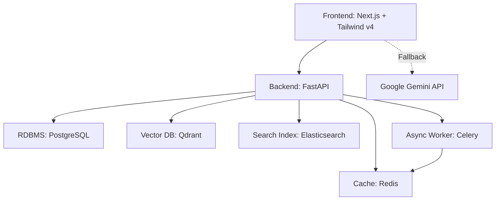

# Technical Architecture - Forensic.AI

## 1. System Overview
Forensic.AI is structured as a decoupled, multi-container system orchestrated via **Docker Compose**. It combines a React/Next.js frontend with a modular FastAPI backend and databases optimized for vector search, caching, and document retrieval.

---

## 2. Infrastructure & Containers

### 2.1. Frontend Service
- **Framework**: Next.js 16 (using Turbopack dev compiler).
- **Styling**: Tailwind CSS v4 + Framer Motion for high-fidelity glassmorphism.
- **3D Engine**: Three.js (`@react-three/fiber` + `@react-three/drei`) for interactive nodes.

### 2.2. Backend API Services
- **Framework**: FastAPI (Python 3.10).
- **Core Modules**:
  - `extraction`: Isolates verifiable claims using structured JSON schemas.
  - `verification`: Performs hybrid RAG evaluation.
  - `retrieval`: Searches Qdrant and Elasticsearch.
- **Async Queue**: Celery workers handle heavy news scrapers and DB logs asynchronously.

### 2.3. Data Tier
- **PostgreSQL**: Stores relational user files, session history, and system audit logs.
- **Redis**: Fast cache layer for search inputs, session tokens, and worker broker lists.
- **Qdrant**: High-speed vector store holding semantic article embeddings.
- **Elasticsearch**: Handles lexical BM25 matching for key phrase verification.
